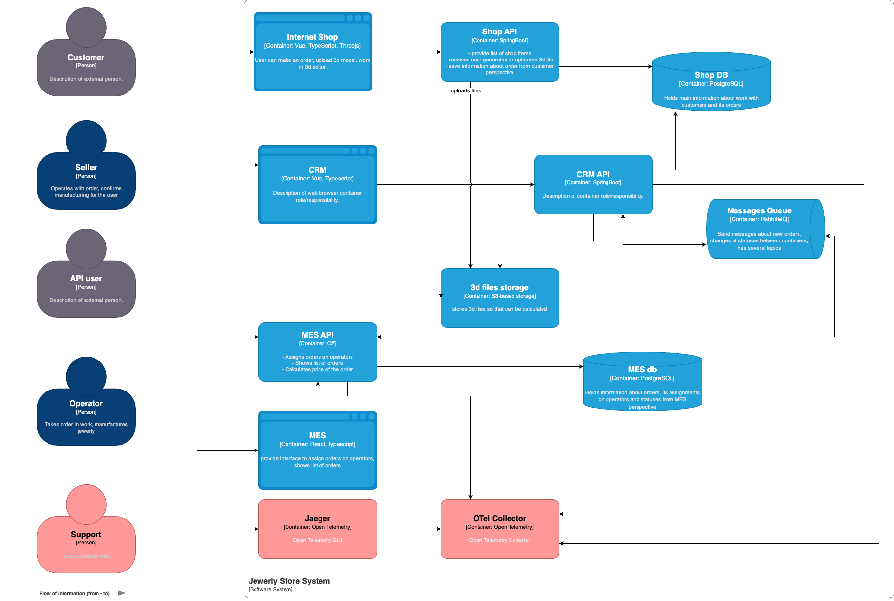

# Задание 3. Трейсинг

## Покрытие трейсингом

### Наблюдаемые сервисы

Необходимо реализовать трейсинг на всех точках входа с фронтов и на последующих сервисах обработки заказа. В текущей ситуации это все сервисы "нашей" разработки:

- Shop
- CRM
- MES

### Передаваемые данные

- Trace ID — уникальный идентификатор цепочки запросов.
- Span ID — идентификатор каждого этапа обработки.
- Parent Span ID — для связи вложенных операций.
- Название сервиса (например, shop, crm, mes).
- Название операции (например, POST /orders).
- HTTP-метод и путь (для API, например, GET /api/orders/{id}).
- Статус ответа (HTTP-код или кастомный статус, например, 200, 500, timeout).
- Временные метки:
  - Начало и конец обработки (start_time, end_time).
  - Задержки между сервисами.
- Теги:
  - Тип протокола (http, amqp).
  - Пользователь (если аутентифицирован, например, user_id=123).

## Мотивация

Трейсинг — это ключ к пониманию, почему клиенты получают заказы с задержками, а партнёры сталкиваются с ошибками API. Он покажет полный путь заказа через Shop, CRM и MES, выявит узкие места (например, зависание сообщений в RabbitMQ) и ускорит поиск причин сбоев с часов до минут.

Технические выгоды:

- Быстрая диагностика ошибок в цепочке сервисов.
- Оптимизация производительности (например, медленных запросов к MES).
- Контроль за потерянными сообщениями в очередях.

Бизнес-эффекты:

- Снижение жалоб клиентов за счёт прозрачности процессов.
- Сохранение B2B-партнёров благодаря стабильности API.
- Обоснованные решения по масштабированию на основе данных.

## Предлагаемое решение

- Используем OpenTelemetry SDK в сервисах собственной разработки
- Пробрасываем trace_id и span_id в асинхронных сообщениях
- Разворачиваем OpenTelemetry Collector
- Разворачиваем Jaeger
- Настраиваем экспорт данных со всех сервисов в коллектор

## Компромиссы

- При большом объёме данных необходимо предусмотреть ротацию и ограничить сроки хранения успешных и неуспешных трейсов
- Сложно (вплоть до невозможно) будет реализовать трейсинг между Shop и CRM, если CRM получает данные напрямую из общих с Shop таблиц

## Аспекты безопасности

- Необходимо предусмотреть ограничение доступа в Jaeger, т.к. там может содержаться чувствительная информация о пользователях и их заказах
