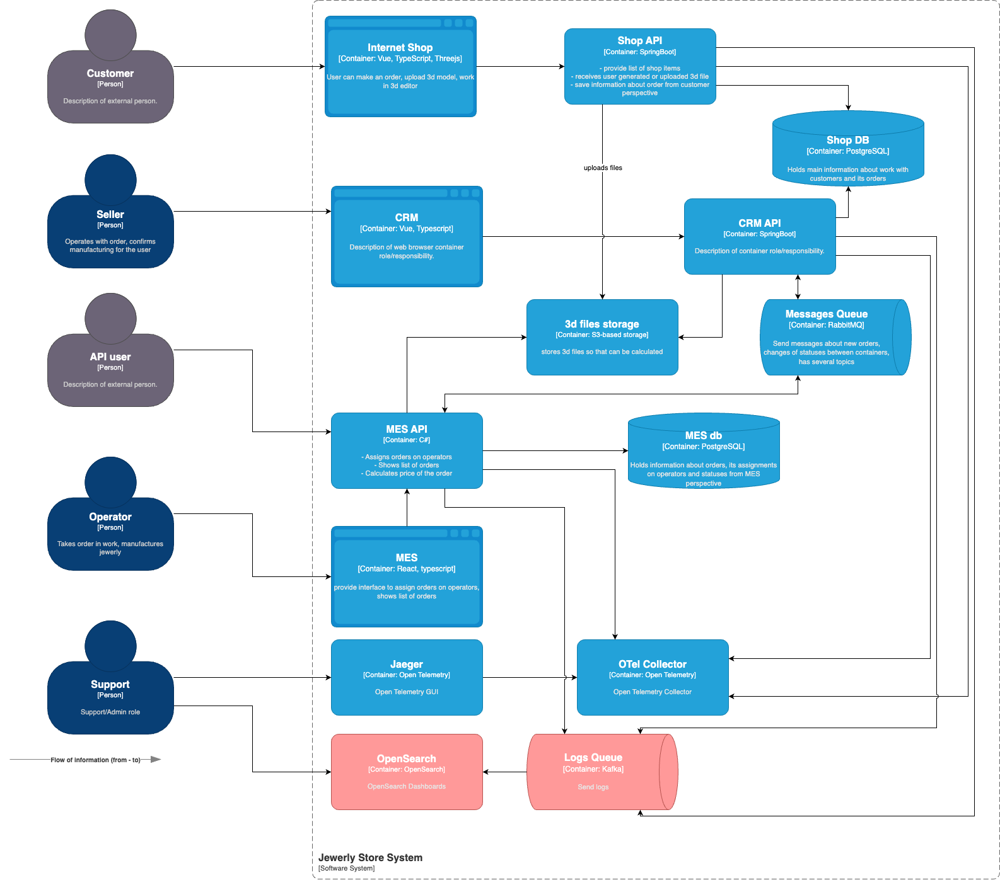

# Задание 4. Логирование

## Необходимые логи

### Основные системы и типы логов

| Система      | Логируемые события (INFO)                                                        | Доп. уровни (WARN, ERROR)                       |
| ------------ | -------------------------------------------------------------------------------- | ----------------------------------------------- |
| **Shop API** | Создание заказа (`order_id`, `user_id`, время), оплата, ошибки валидации         | `ERROR`: сбои платежей, 5xx-ошибки              |
| **CRM API**  | Изменение статуса заказа (`order_id`, `old_status` → `new_status`, `manager_id`) | `WARN`: дублирующиеся заказы, задержки RabbitMQ |
| **MES API**  | Старт/завершение производства (`order_id`, `model_id`, время выполнения)         | `ERROR`: падение расчета стоимости, таймауты    |

#### Режимы логирования:

- **DEBUG**: Детальная информация для отладки (параметры входящих и исходящих запросов, валидация, вычисления, аутентификация, и т.д.)
- **INFO**: Основные бизнес-события, требующие обязательного логирования
- **WARN**: Потенциальные проблемы, не нарушающие работу системы
- **ERROR**: Критические ошибки, требующие немедленного реагирования

## Мотивация

- Быстрая диагностика: Логи помогают моментально находить причины сбоев (ошибки API, зависшие сообщения в RabbitMQ, медленные запросы к БД) вместо часов ручного поиска.
- Аудит и безопасность: Фиксация всех изменений (кто и когда менял статус заказа, доступ к API и т.д.) для расследования инцидентов.

## Предлагаемое решение

### Компоненты системы логирования на OpenSearch

| Компонент            | Назначение                                            | Технологии            |
| -------------------- | ----------------------------------------------------- | --------------------- |
| **Агенты сбора**     | Сбор и отправка логов с сервисов (Shop API, CRM, MES) | Fluent Bit            |
| **Брокер сообщений** | Буферизация логов для защиты от перегрузки            | Apache Kafka          |
| **OpenSearch**       | Хранение, индексация и поиск логов                    | OpenSearch            |
| **Визуализация**     | Дашборды для анализа логов                            | OpenSearch Dashboards |

#### Ключевые особенности:

- **Fluent Bit**: легковесный агент с минимальным потреблением ресурсов
- **Kafka**: гарантированная доставка логов при пиковых нагрузках
- **OpenSearch**: горизонтально масштабируемое хранилище с полнотекстовым поиском

## Анализ логов

Используем GUI для работы с логами при расследовании инцидентов и дебаге приложений.

Мы не делаем:

- алертинг до проработки процессов поддержки и назначения ответственных за реакцию на алерты
- автоматический поиск аномалий и какие-то расчёты метрик на основе логов, для этого у нас есть мониторинг

## Критерии выбора технологий

### Сборка логов

| Критерий             | Logstash                   | Filebeat                  | Fluent Bit           | Data Prepper (OpenSearch)      |
| -------------------- | -------------------------- | ------------------------- | -------------------- | ------------------------------ |
| **Основная роль**    | Трансформация и обогащение | Доставка логов            | Универсальный сбор   | ETL-обработка для OpenSearch   |
| **Лицензия**         | SSPL                       | Apache 2.0                | Apache 2.0           | Apache 2.0                     |
| **Ресурсы**          | Требует много CPU/RAM      | Минимальные               | Очень лёгкий (<10MB) | Средние (кластерный режим)     |
| **Где работает**     | Серверы                    | Серверы, агенты           | K8s, edge-устройства | Серверы/облако (AWS)           |
| **Трансформация**    | Поддержка Grok, фильтров   | Только парсинг            | Базовые фильтры      | Парсинг, агрегация, обогащение |
| **Интеграция**       | 200+ плагинов              | Elastic/OpenSearch        | 100+ output-плагинов | OpenSearch, S3, Kafka          |
| **Масштабируемость** | Вертикальная               | Лёгкая горизонтальная     | Горизонтальная       | Автомасштабирование (в AWS)    |
| **Пример use-case**  | Сложная ETL-обработка      | Доставка логов с серверов | Сбор логов в K8s     | Пайплайны для AWS-логов        |

#### Ключевые отличия:

- **Data Prepper** — заточен под OpenSearch, поддерживает сложную обработку перед ingest (аналог Logstash, но с оптимизацией под OpenSearch).
- **Fluent Bit** — лидер для Kubernetes и встраиваемых систем.
- **Logstash** — максимальная гибкость (но тяжеловесный).
- **Filebeat** — только доставка без трансформации.

### Хранение и анализ логов

| Критерий            | OpenSearch (с Dashboards)        | ELK Stack (Elasticsearch + Kibana)         | Grafana Loki                      | Splunk                        |
| ------------------- | -------------------------------- | ------------------------------------------ | --------------------------------- | ----------------------------- |
| **Лицензия**        | Apache 2.0                       | Elasticsearch: SSPL, Kibana: проприетарная | AGPLv3                            | Проприетарная                 |
| **Скорость**        | Высокая                          | Очень высокая                              | Средняя (оптимизирован под метки) | Очень высокая                 |
| **Масштаб**         | До экзабайт данных               | До экзабайт (требует ресурсов)             | Петабайты (дешёвое хранение в S3) | Любые объёмы (дорого)         |
| **Интерфейс**       | OpenSearch Dashboards            | Kibana                                     | Grafana                           | Splunk Web                    |
| **Стоимость**       | Бесплатен                        | Бесплатен (платные опции)                  | Бесплатен                         | Очень дорогой                 |
| **Сильные стороны** | Полная замена ELK, S3-интеграция | Зрелая экосистема                          | Экономичное хранение              | Готовое корпоративное решение |
