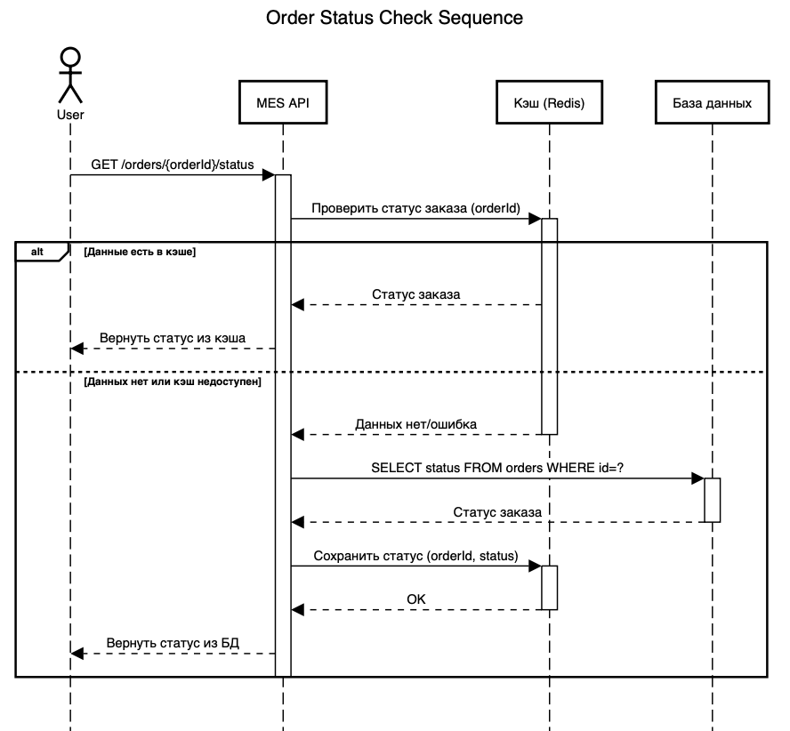

# Задание 5. Кеширование

## Кэшируемые данные

### Shop API

- Мастер-данные по товарам в каталоге магазина

### MES API

- Состояние заказов

## Мотивация

- Кэширование каталога товаров позволить существенно повысить скорость работы интерфейса покупателей магазина
- Кэширование состояния заказов (на минимальный срок в несколько секунд) позволит существенно снизить риск критического роста нагрузки на БД при повышении частоты запросов по API

Оба решения существенно повысят уровень комфорта при работе с нашими сервисами.

## Предлагаемое решение

### Sequence диаграмма

### Стратегия инвалидации кэша

### Сравнительный анализ стратегий инвалидации кэша для MES API

| Стратегия                       | Принцип работы                                              | Преимущества                                                                                                             | Недостатки                                                                                                      | Лучшие сценарии использования                                                                  |
| ------------------------------- | ----------------------------------------------------------- | ------------------------------------------------------------------------------------------------------------------------ | --------------------------------------------------------------------------------------------------------------- | ---------------------------------------------------------------------------------------------- |
| **Временная инвалидация** (TTL) | Автоматическое удаление данных после фиксированного времени | 1. Простота реализации 2. Минимальные накладные расходы 3. Предсказуемое поведение                                 | 1. Возможность отображения устаревших данных до истечения TTL 2. Нет реакции на изменения в реальном времени | Данные, которые изменяются редко и могут быть устаревшими (например, каталог товаров на сайте) |
| **Инвалидация по ключу**        | Ручное удаление конкретных записей при изменении данных     | 1. Актуальность данных гарантируется 2. Минимизирует объем инвалидации 3. Эффективно для часто изменяющихся данных | 1. Сложнее реализовать 2. Требует интеграции с системой изменений данных 3. Возможны "дыры" в инвалидации | Данные, где важна актуальность (остатки товаров, статусы заказов)                              |

#### Рекомендации для Alexandrite:

- **Для статусов заказов** - Гибридный подход: инвалидация по ключу + TTL (например, 1 минута как fallback)
- **Для справочников изделий** - временная инвалидация (TTL до 1 часа)
